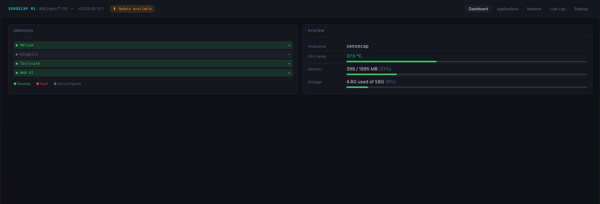
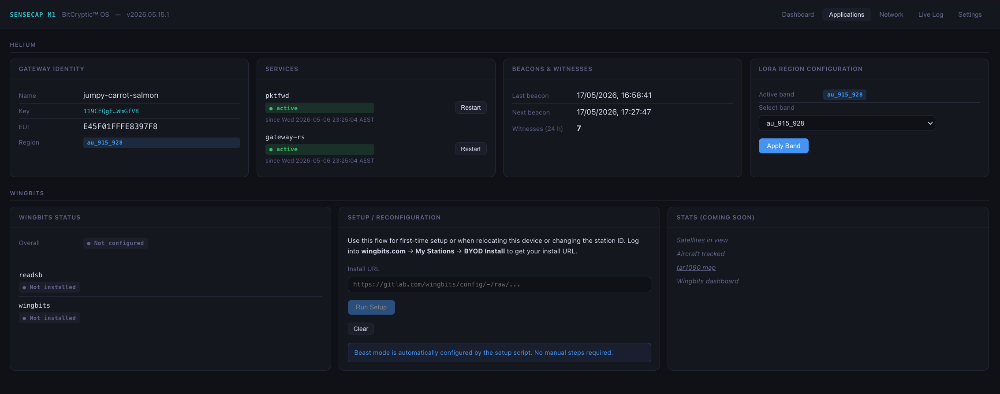
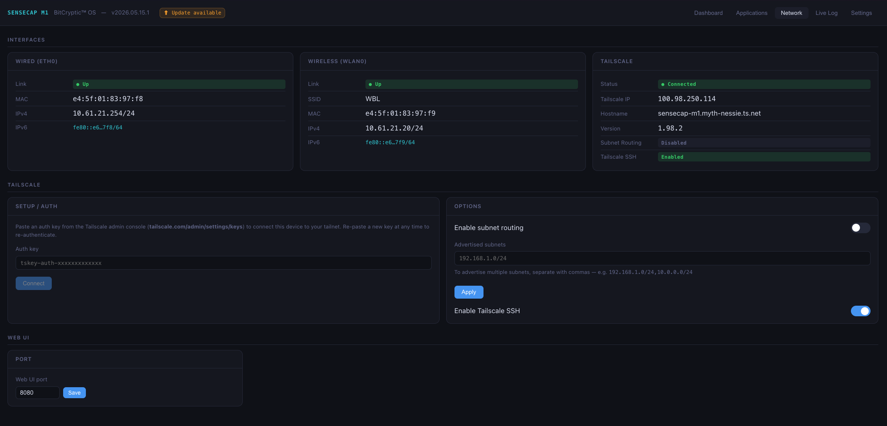
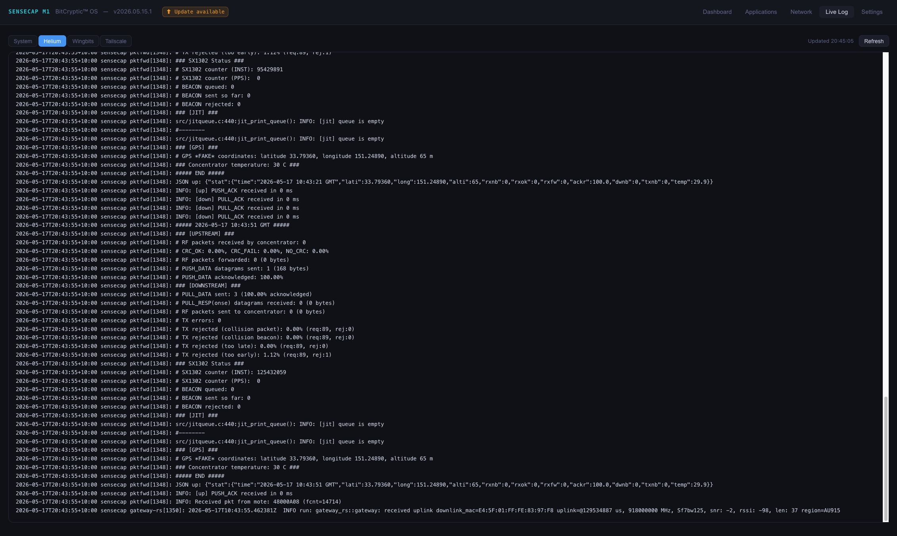
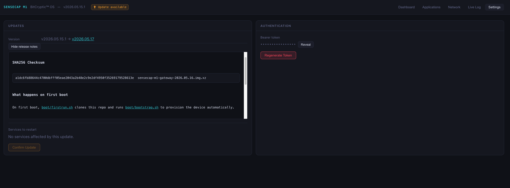

# SenseCap M1 Gateway Platform

An open-source replacement firmware platform for the **Seeed SenseCap M1** LoRaWAN gateway, targeting the Helium IoT network.

No hidden services. No telemetry. No third-party backdoors. Fully auditable.

---

## What This Is

This project replaces the default platform that ships on the SenseCap M1. It provides a clean, minimal stack using only open-source components:

- **Semtech `lora_pkt_fwd`** — the reference packet forwarder for the SX1302 concentrator
- **Helium `gateway-rs`** — lightweight Helium network gateway daemon
- **ATECC608A** — on-board secure element for swarm key storage (no software key files)
- **Tailscale** — optional remote access, managed via the web UI using your own auth key, no config file required

The goal is a gateway you can fully understand, audit, and trust — running on hardware you already own.

---

## What This Is NOT

- Not affiliated with Seeed Studio or the Helium Foundation
- Not a general-purpose LoRaWAN gateway platform (SenseCap M1 hardware only — no abstraction sprawl)
- Not a cloud service — your gateway, your keys, your data

---

## Hardware Requirements

**This firmware is for SenseCap M1 only.** It will not work on other gateways without significant modification.

| Component | Detail |
|-----------|--------|
| SBC | Raspberry Pi 4B (inside SenseCap M1) |
| Concentrator | RAK2287 (SX1302 / SX1250 SPI) |
| Secure Element | Microchip ATECC608A on I2C-1 (0x60) |
| Connectivity | Ethernet (eth0) for Gateway EUI derivation |
| GPS | None — fake GPS configured in the web UI or `config/` |

---

## First Boot

First boot is fully automated. Flash the image using Raspberry Pi Imager (set your username, password, and SSH key in the Imager settings), insert the card, and power on. The gateway clones this repo, runs `boot/bootstrap.sh`, and reboots. After the reboot, the web UI is available at `http://<hostname>:8080`.

---

## Flashing a Pre-Built Image

Pre-built images are available on the [Releases](https://github.com/bitcryptic-gw/sensecap-m1-gateway/releases) page.

**Requirements:**
- Raspberry Pi Imager (available for Windows, Mac, Linux)
- A microSD card (8 GB minimum)

**Steps:**
1. Download the latest `.img.xz` from Releases and verify the SHA256 checksum.
2. Open Raspberry Pi Imager, select the downloaded image, and use the settings gear to configure your username, password, SSH key, hostname, and Wi-Fi before flashing.
3. Flash to your microSD card and insert into the SenseCap M1.
4. Power on — first boot clones this repo and runs `boot/bootstrap.sh` automatically. This takes a few minutes and ends with a reboot.
5. After the reboot, the web UI is available at `http://<hostname>:8080`. The bearer token is printed to the console during first boot; recover it at any time via `sudo cat /etc/gateway-ui/token`.

---

## Configuration

Configuration is done through the web UI.

### Web UI

`http://<hostname>:8080` — accessible via Tailscale (or LAN if you haven't restricted it).

**Authentication:** Bearer token stored at `/etc/gateway-ui/token`. Printed to the console during first boot. Recovery:
```bash
sudo cat /etc/gateway-ui/token
```

**Tabs:**

| Tab | What it shows |
|-----|---------------|
| **Dashboard** | Grouped service status (Helium / Wingbits / Tailscale / Web UI), system metrics (CPU / memory / disk) |
| **Applications** | Helium: gateway identity, beacon stats, LoRa region. Wingbits: status and in-browser setup/reconfiguration flow |
| **Network** | Interface cards (eth0 / wlan0 / Tailscale), Tailscale auth + options (subnet routing, SSH toggle), web UI port |
| **Live Log** | Unified journal stream with filter pills: System / Helium / Wingbits / Tailscale |
| **Settings** | OTA updates (version check, changelog, smart service restart, SSE stream), bearer token display and regenerate |

The header bar shows the current build version (`SenseCap M1 — BitCryptic OS vYYYY.MM.DD`). An amber **⬆ Update available** badge appears when a newer GitHub release is detected; clicking navigates to the Settings OTA section.

*All screenshots taken on desktop. Mobile layout stacks cards vertically.*







---

## Band / Region Selection

Band is configured from the **Applications** tab in the web UI. To change band after first boot, select the new region and apply — the forwarder restarts automatically.

| Band | Region | Notes |
|------|--------|-------|
| `au_915_928` | AU915 | **FSB2 (ch 8–15 + 65)** — Helium AU default |
| `us_902_928` | US915 | **FSB2 (ch 8–15 + 65)** — Helium US default |
| `eu_863_870` | EU868 | 8 standard TTN/Helium channels, 868.1–868.5 + 867.1–867.9 MHz |
| `as_923_1` | AS923-1 | Singapore, Indonesia, Vietnam; 922.0–923.4 MHz |
| `as_923_2` | AS923-2 | Vietnam (alternate plan); 921.4–922.8 MHz |
| `in_865_867` | IN865 | India; 865.0625, 865.4025, 865.985 MHz (3 mandatory channels) |
| `kr_920_923` | KR920 | South Korea; 922.1–923.5 MHz |
| `ru_864_870` | RU864 | Russia; 864.1–864.9 + 868.7–869.3 MHz |
| `cn_470_510` | CN470 | China; FSB11 (486.3–487.7 MHz uplink, 500.3–509.7 MHz downlink) |

> **Helium note:** Helium AU and Helium US both use FSB2. Using any other FSB will result in zero PoC activity.

---

## How It Works

```
LoRa devices (nodes)
       │  RF
       ▼
RAK2287 concentrator (SX1302 via SPI /dev/spidev0.0)
       │  UDP 127.0.0.1:1680
       ▼
lora_pkt_fwd  [pktfwd.service]
       │  UDP 127.0.0.1:1680
       ▼
gateway-rs  [gateway-rs.service]
       │  ECC608 swarm key (i2c-1:0x60 slot 0)
       ▼
Helium IoT Network (mainnet)
```

- `pktfwd.service` runs the Semtech packet forwarder, which handles SX1302 hardware and forwards raw LoRa packets as UDP datagrams
- `gateway-rs.service` runs the native `helium_gateway` binary, connecting to the Helium mainnet using the ECC608A secure element for identity
- Tailscale is optional; managed via the web UI Network tab using a setuid wrapper (no sudo required)
- **Docker** is installed on the device and available for operator use, but is not used by any part of the Helium or Wingbits stack

---

## Tailscale

Tailscale is optional and managed entirely from the **Network** tab in the web UI. You supply your own auth key — this project never provides one.

**Setup:**
1. Navigate to the Network tab → Tailscale → Setup/Auth card
2. Paste a one-time auth key from [tailscale.com/settings/keys](https://tailscale.com/settings/keys)
3. Click **Connect** — the gateway authenticates and the status card updates immediately

**Options (available once connected):**
- **Subnet routing** — advertise the gateway's local subnet to your Tailnet
- **SSH** — enable Tailscale SSH access

All Tailscale operations run through a setuid wrapper (`/usr/local/bin/tailscale-wrapper`) — no sudo grants required. The `gateway-ui` user is set as the Tailscale operator at provisioning time.

**To install Tailscale manually** (if not already provisioned by bootstrap):
```bash
sudo /opt/gateway/scripts/install-tailscale.sh
```

---

## OTA Updates

The web UI Settings tab provides over-the-air updates direct from this GitHub repository.

**How it works:**
1. The header polls GitHub releases every 60 seconds. If a newer tag is found, an amber **⬆ Update available** badge appears.
2. Click the badge (or navigate to Settings → OTA) to see the version comparison, collapsible release notes, and a list of changed files.
3. Service group checkboxes are pre-selected based on which files changed. Deselect any groups you don't want restarted.
4. Click **Update** — the gateway runs `git pull` and restarts the selected services. Output streams live via SSE.
5. If the web UI service itself restarts mid-update, the browser auto-reloads when it comes back.

The version is stamped at provisioning time into `/etc/gateway-version` using `git describe --tags --always`. All update operations run through a setuid wrapper (`/usr/local/bin/ota-update-wrapper`) — no sudo required.

---

## Wingbits (Optional)

Wingbits is an optional ADS-B data aggregation service. It runs as native systemd services (`readsb.service` + `wingbits.service`) independent of the Helium stack and does not interfere with LoRaWAN operation.

**Setup via web UI:**
Navigate to the **Applications** tab → Wingbits section → paste the station install URL from your Wingbits dashboard → the setup streams real-time output in the browser.

**Setup via CLI** (equivalent):
```bash
# One-time dependency install (run once at provisioning — bootstrap handles this)
sudo /opt/gateway/scripts/install-wingbits-deps.sh

# Setup or reconfigure
sudo /opt/gateway/scripts/wingbits-setup.sh "https://gitlab.com/wingbits/config/-/raw/install.sh?station_id=..."
```

`wingbits-setup.sh` is idempotent — re-run it for station relocation or ID change.

The `wingbits-setup-wrapper` setuid binary (`/usr/local/bin/wingbits-setup-wrapper`, compiled from `scripts/wingbits-setup-wrapper.c` during deps install) allows the web UI to invoke the setup script as root in a controlled way. Source is in the repo.

---

## Building from Source

The `lora_pkt_fwd` binary must be compiled from the Semtech sx1302_hal repository for the RAK2287 / SX1302 hardware.

```bash
# Install build dependencies
sudo apt-get install -y git build-essential libssl-dev

# Clone sx1302_hal
git clone https://github.com/Lora-net/sx1302_hal.git
cd sx1302_hal

# Build
make all

# Install
sudo cp packet_forwarder/lora_pkt_fwd /usr/local/bin/
sudo mkdir -p /opt/gateway/pktfwd
sudo ln -sf /opt/gateway/scripts/reset_lgw.sh /opt/gateway/pktfwd/reset_lgw.sh
```

> `lora_pkt_fwd` (and `chip_id`) hardcode `./reset_lgw.sh` as a relative path and look for it in their working directory (`/opt/gateway/pktfwd`). `boot/bootstrap.sh` creates this symlink automatically during provisioning. If you are setting up manually, the `ln -sf` line above is required — without it, `pktfwd.service` will fail on start with `sh: ./reset_lgw.sh: not found`.

**helium_gateway** must be installed as a native ARM64 musl binary at `/usr/local/bin/helium_gateway`. Download a release from the [helium-systems/gateway-rs releases page](https://github.com/helium/gateway-rs/releases) — select the `aarch64-unknown-linux-musl` build and extract the binary.

---

## Directory Layout

```
/opt/gateway/               (repo root)
├── boot/
│   ├── bootstrap.sh        # First-time provisioning (run by firstrun.sh on first boot)
│   ├── firstrun.sh         # Injected into image — clones repo and calls bootstrap.sh
│   ├── config.txt          # Pi boot config
│   ├── build-image.sh      # GitHub Actions image build script
│   └── tag-release.sh      # Mac-side release tagging helper
├── config/
│   ├── settings.toml       # gateway-rs config (ECC608A / i2c-1)
│   ├── global_conf.json    # Active frequency plan
│   └── global_conf.*.json  # Frequency plan templates (one per region)
├── docker/                 # Reserved for future non-Helium/non-Wingbits workloads
├── docs/
│   └── screenshots/        # UI screenshots for README
├── gateway-ui/             # FastAPI web UI source
│   ├── main.py
│   ├── requirements.txt
│   └── static/             # index.html, app.js, style.css
├── pktfwd/
│   └── reset_lgw.sh        # Symlink → scripts/reset_lgw.sh (required by lora_pkt_fwd)
├── scripts/
│   ├── reset_lgw.sh        # SX1302 GPIO reset
│   ├── wingbits-setup.sh   # Wingbits setup / reconfigure (idempotent)
│   ├── install-wingbits-deps.sh
│   ├── install-tailscale.sh
│   ├── tailscale-wrapper.c # Setuid wrapper source (Tailscale ops)
│   ├── wingbits-setup-wrapper.c
│   ├── ota-update-wrapper.c
│   └── udev/
│       └── 99-rtlsdr.rules # RTL-SDR symlink → /dev/rtlsdr0
└── systemd/
    ├── pktfwd.service
    ├── gateway-rs.service
    ├── gateway-ui.service
    ├── readsb.service
    └── wingbits.service

/etc/gateway-ui/token       # Bearer token (owner: gateway-ui, mode 600)
/etc/gateway-version        # Build version stamp (written by bootstrap.sh)
/usr/local/bin/tailscale-wrapper     # Compiled setuid wrapper
/usr/local/bin/wingbits-setup-wrapper
/usr/local/bin/ota-update-wrapper
```

---

## Contributing

This project is hardware-specific by design. Contributions welcome for:

- Bug fixes and correctness improvements
- Additional frequency plan configs (verified against Helium network requirements)
- Documentation improvements
- Web UI improvements

**Hardware variant contributions** (e.g. support for RAK2287 over USB, or other concentrator modules) are welcome via PRs — please keep SenseCap M1 behaviour unchanged.

Please open an issue before starting large changes.

---

## License

MIT — see [LICENSE](LICENSE).

Copyright (c) 2026 SenseCap M1 Gateway Contributors.
